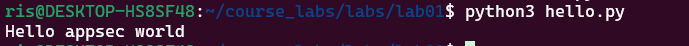
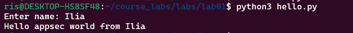
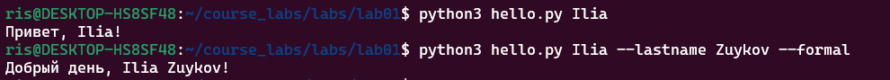
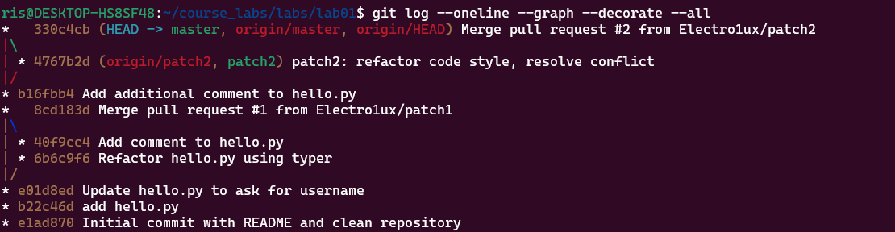
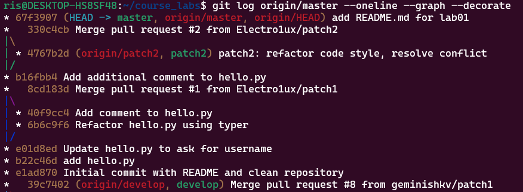

# Отчёт по лабораторной работе 1
<a href="https://docs.github.com/en"></a>
<a href="https://daringfireball.net/projects/markdown"></a> 
<a href="https://symbl.cc/en/unicode-table"></a> 
<a href="https://shields.io"></a>
<a href="https://img.shields.io/badge/Risk_Analyze-2448a2"></a> </a>


## Задание

- [x] 1. Зарегистрироваться на почтовом сервисе **Gmail**. В случае наличия аккаунта - не требуется
- [x] 2. Зарегистрироваться на сервисе совместной разработки **GitHub**. В случае наличия аккаунта требуется произвести дополнительные настройки и обновить данные персонификации
- [x] 3. Отправить зарегистрированный адрес почтового ящика личным сообщением
- [x] 4. Отправить зарегистрированный логин личным сообщением
- [x] 5. Ознакомиться со ссылками учебного материала и формализованными требованиями из основного описания
- [x] 6. Сгенерировать **SSH** ключ и добавить его в список ключей для сервиса **GitHub**
- [x] 7. Сгенерировать **Personal Token** с правами **gist** и сохранить его в файл
- [x] 8. Сгенерировать GnuPG для подтверждения подписания коммитов и возможно использование Х.509 (включить в отчет описание, что такое `smimesign`)
- [x] 9. Подготовить глобальные переменные окружения для **GitHub**
- [x] 10. Ознакомиться с материалами `gh` сервиса и использовать их для авторизации, `commit`, `pull request` и тд.
- [x] 11. Выполнить инструкцию учебного материала
- [x] 12. Оформить `README.md` по аналогии и использовать `shield`, etc.
- [x] 13. Составить `gist` отчет и отправить ссылку личным сообщением


## 1. Инициализация репозитория
- Создание локального репозитория.
```
git init # Инициализирует локальный репозиторий в текущей папке
```
- Очистка склонированного репозитория.
```
rm # для удаления лишних файлов и папок
```
- Сделан первый commit с подписью GPG (-S).
```
touch README.md # Создание README
git add --all # Добавление в индекс
git commit -S -m "Initial commit with README and clean repository" # Создание подписанного коммита с комментарием
git push # Для отправки изменений в удаленный репозиторий
```

<a href="https://github.com/geminishkv/course_labs/commit/e1ad8709ae09885d26922263281fdaada1d572a8"> Initial commit with README and clean repository

---

## 2. Создание и добавление hello.py
- Создан файл `hello.py` с «грязным» кодом для учебного Hello appsec world.
```
nano hello.py # Создание файла
git add hello.py # Добавление изменений в индекс
```


- Сделан commit с подписью (-S).
```
git commit -S -m "add hello.py" # Создание подписанного коммита
```
<details><summary><strong>Код программы</strong></summary><p>
 
```print("Hello appsec world")```

 </p></details>
 
<a href="https://github.com/geminishkv/course_labs/commit/b22c46de9b7e3f0184ee71ecd2a958f9c4774db0"> add hello.py

---

## 3. Модернизация кода hello.py
- Изменён код, чтобы запрашивалось имя пользователя.



- Сделан commit с подписью (-S).
```
git commit -S -m "Update hello.py to ask for username"
```
<details><summary><strong>Код программы</strong></summary><p>

```
name = input("Enter name: ")
print(f"Hello appsec world from {name}")
```

 </p></details>
 
 <a href="https://github.com/geminishkv/course_labs/commit/e01d8ed140cdda38c443388b3856b05f164cdafc"> Update hello.py to ask for username

---

## 4. Ветка patch1 и pull request
- Создана ветка `patch1`.
- Реализован рефакторинг кода с использованием `typer`.
- Добавлены комментарии.
- Создан pull request patch1 -> master и выполнен merge.
```
git checkout -b patch1 # переключение на ветку вместе с ее созданием
git add hello.py # Добавление изменений
git commit -S -m "Refactor hello.py using typer" # Создание коммита
git push -u origin patch1 # Отправка изменений в удаленный репозиторий в ветку patch1
gh pr create --title "Patch1: Refactor hello.py" --body "Refactor with typer" --base master --head patch1 # Создание pr С названием, описанием, указанием целевой и исходной веток
```
<details>
<summary><strong>Код программы</strong></summary>
 
```
import typer

def main(
    name: str,
    lastname: str = typer.Option("", help="Фамилия пользователя."),
    formal: bool = typer.Option(False, "--formal", "-f", help="Использовать формальное приветствие."),
):
    greeting = f"Добрый день, {name} {lastname}!" if formal else f"Привет, {name}!"
    print(greeting)


if __name__ == "__main__":
    typer.run(main)
```
</details> 

<a href="https://github.com/geminishkv/course_labs/commit/6b6c9f6203ab2a1090dd92347cba2dbbad55c182"> Refactor hello.py using typer
<a href="https://github.com/geminishkv/course_labs/commit/40f9cc40ae0c68041ddebe1318e2eebb339b889a"> Add comment to hello.py
<a href="https://github.com/geminishkv/course_labs/commit/8cd183dff6d7f2c0978bedb7ad38742fb8875cbf"> Merge pull request #1 from Electro1ux/patch1



---

## 5. Дополнительные комментарии в master
- Добавлен комментарий в master после merge patch1.
```
git add hello.py
git commit -S -m "Add comments to hello.py"
git push
```
- merge PR patch1 -> master и удаление ветки
```
gh pr merge patch1 --merge # Слияние PR
git push origin --delete patch1 # Удаление ветки в удаленном репозитории
git branch -d patch1 # Удаление ветки в локальном репозитории
```

<a href="https://github.com/geminishkv/course_labs/commit/b16fbb4fa303f5335483d0c99cb551ed4d13fb9b"> Add additional comment to hello.py

---

## 6. Ветка patch2 и работа с конфликтом
- Создана ветка `patch2`.
- Изменён код для приведения к единому стилю (refactor code style).
- Возник конфликт с master при merge pull request.
```
git checkout -b patch2 # Создание ветки и переключение
git add hello.py # Добавление изменений в индекс
git commit -S -m "Patch2: Refactor code style" # Создание коммита
git push -u origin patch2 # Отправка изменений
gh pr create --title "Patch2: Refactor code style" --body "Refactor code style for hello.py" --base master --head patch2 # Создание PR
```
- Решение конфликта через rebase.
- Commit с подписью (-S) и успешная публикация patch2.
```
git fetch origin # Загрука изменений из удаленного репозитория
git checkout patch2 # Переключение на ветку patch2
git rebase origin/master # Перенос коммитов из текущей ветки (patch2) в конец ветки origin/master
git add hello.py # Добавление изменений в индекс
git rebase --continue # Продолжение rebase после предлагаемого устранения конфликтов
git push -f # Принудительное обновление удаленной ветки patch2
```

- Слияние PR
```
gh pr merge patch2 --merge # Слияние PR
git checkout master # Переключение на master
```
<a href="https://github.com/geminishkv/course_labs/commit/4767b2dfb39e75bec99b1afc6226a49ad3897e98"> patch2: refactor code style, resolve conflict
<a href="https://github.com/geminishkv/course_labs/commit/330c4cbd1aa6197847c40c00c74cc9bf42b7bd48"> Merge pull request #2 from Electro1ux/patch2

---

## 7. История коммитов и веток
Командой `git log --oneline --graph --decorate --all` выведем историю изменений



Командой `git log origin/master --oneline --graph --decorate` выведем историю изменений удаленного репозитория


---

## 8. Ответы на вопросы
Команда git rebase перемещает коммиты с одной ветки в конец другой, таким образом эта команда используется для переноса серии коммитов в другую начальную точку
До перемещения:
```
          A---B---C topic
         / 
    D---E---F---G master
```
После перемещения:
```
                  A'--B'--C' topic
                 /
    D---E---F---G master
```
Команда git fetch 
## 9. Ссылки
- Репозиторий: <a href="https://github.com/Electro1ux/course_labs/tree/master/labs/lab01"> Репозиторий лабораторной № 1  
- Gist-отчёт:  <a href="https://github.com/Electro1ux/course_labs/blob/master/labs/lab01/README.md"> Ссылка на отчет
