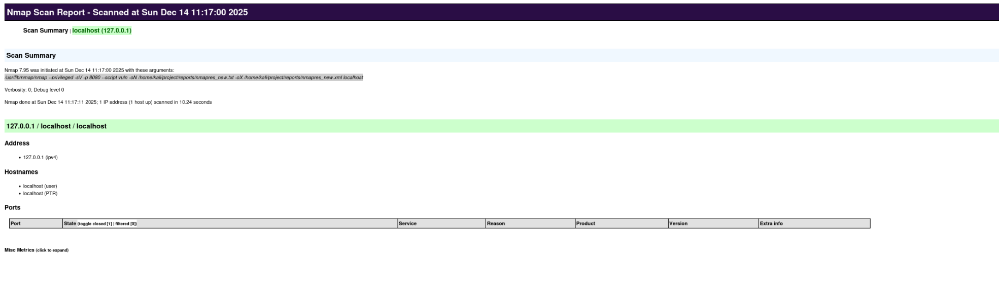

<div align="center">
<h1><a id="intro">Лабораторная работа №3</a><br></h1>
<a href="https://docs.github.com/en"></a>
<a href="https://daringfireball.net/projects/markdown"></a> 
<a href="https://symbl.cc/en/unicode-table"></a> 
<a href="https://shields.io"></a>
<a href="https://img.shields.io/badge/Risk_Analyze-2448a2"></a> </a></div>

***

## Задание

- [x] 1. Опишите используемые методы по их назначению, как они функционируют и какие результаты могут дать для оценки. Используйте сноску из материалов выше по флагам команд.

```
$ nmap -iL targets.txt # Сканирование множества целей, указанных в файле targets.txt (IP-адреса, диапазоны, домены)
$ nmap -sL targets.txt # List Scan — вывод списка целей и их DNS-имён без отправки каких-либо сетевых пакетов
$ nmap -sn targets.txt # Ping Scan — определение доступных (online) хостов без сканирования портов
$ nmap -Pn targets.txt # Отключение определения доступности хостов, все цели считаются online (полезно при ICMP-фильтрации)

$ nmap -PS80,443 targets.txt # TCP SYN ping по портам 80 и 443 для определения доступных хостов
$ nmap -PA80 targets.txt # TCP ACK ping по порту 80, используется для обхода firewall
$ nmap -PU53 targets.txt # UDP ping по порту 53 (DNS) для определения активности хоста
$ nmap -PY targets.txt # SCTP ping для обнаружения хостов в сетях с поддержкой SCTP

$ nmap -PE targets.txt # ICMP echo request (классический ping) для обнаружения доступных хостов
$ nmap -PP targets.txt # ICMP timestamp request для определения доступности хостов
$ nmap -PM targets.txt # ICMP netmask request для обнаружения хостов (редко используется)

$ nmap -PO1,2,4 targets.txt # Host discovery через IP-протоколы (ICMP, IGMP, IP-in-IP), обход нестандартных фильтров
$ nmap -n targets.txt # Отключение DNS-резолвинга для ускорения сканирования
$ nmap -R targets.txt # Принудительный DNS-резолвинг всех целей

$ nmap --dns-servers 8.8.8.8 targets.txt # Использование пользовательского DNS-сервера вместо системного
$ nmap --system-dns targets.txt # Использование DNS-настроек операционной системы
$ nmap --traceroute targets.txt # Определение сетевого пути (hop'ов) до каждой цели после сканирования

```

- [x] 2. Выведите на терминале и проанализируйте следующие команды консоли

```bash
$ nmap localhost # Сканирование стандартных портов localhost
$ nmap -sC localhost # Сканирование со скриптами категории default

$ nmap -p localhost # Ключ -p используется для указания конкретных портов
$ nmap -O localhost # Определение операционной системы

$ nmap -p 80 localhost # Проверка порта 80 (HTTP)
$ nmap -p 443 localhost # Проверка порта 443 (HTTPS)
$ nmap -p 8443 localhost # Проверка порта 8443 (часто используется веб-интерфейсами)
$ nmap -p "*" localhost # В -p указываются конкретные номера портов
$ nmap -sV -p 22,8080 localhost # Определение версий сервисов на указанных портах
```
```
┌──(kali㉿kali)-[~]
└─$ nmap localhost  
Starting Nmap 7.95 ( https://nmap.org ) at 2025-12-15 08:26 EST
Nmap scan report for localhost (127.0.0.1)
Host is up (0.0000030s latency).
Other addresses for localhost (not scanned): ::1
All 1000 scanned ports on localhost (127.0.0.1) are in ignored states.
Not shown: 1000 closed tcp ports (reset)

Nmap done: 1 IP address (1 host up) scanned in 0.14 seconds
                                                                                                        
┌──(kali㉿kali)-[~]
└─$ nmap -sC localhost
Starting Nmap 7.95 ( https://nmap.org ) at 2025-12-15 08:26 EST
Nmap scan report for localhost (127.0.0.1)
Host is up (0.0000030s latency).
Other addresses for localhost (not scanned): ::1
All 1000 scanned ports on localhost (127.0.0.1) are in ignored states.
Not shown: 1000 closed tcp ports (reset)

Nmap done: 1 IP address (1 host up) scanned in 0.26 seconds
                                                                                                        
┌──(kali㉿kali)-[~]
└─$ nmap -p22 localhost
Starting Nmap 7.95 ( https://nmap.org ) at 2025-12-15 08:26 EST
Nmap scan report for localhost (127.0.0.1)
Host is up (0.000042s latency).
Other addresses for localhost (not scanned): ::1

PORT   STATE  SERVICE
22/tcp closed ssh

Nmap done: 1 IP address (1 host up) scanned in 0.10 seconds
                                                                                                        
┌──(kali㉿kali)-[~]
└─$ nmap -O localhost
Starting Nmap 7.95 ( https://nmap.org ) at 2025-12-15 08:27 EST
Nmap scan report for localhost (127.0.0.1)
Host is up (0.000054s latency).
Other addresses for localhost (not scanned): ::1
All 1000 scanned ports on localhost (127.0.0.1) are in ignored states.
Not shown: 1000 closed tcp ports (reset)
Too many fingerprints match this host to give specific OS details
Network Distance: 0 hops

OS detection performed. Please report any incorrect results at https://nmap.org/submit/ .
Nmap done: 1 IP address (1 host up) scanned in 1.57 seconds
                                                                                                        
┌──(kali㉿kali)-[~]
└─$ nmap -p80 localhost
Starting Nmap 7.95 ( https://nmap.org ) at 2025-12-15 08:27 EST
Nmap scan report for localhost (127.0.0.1)
Host is up (0.000040s latency).
Other addresses for localhost (not scanned): ::1

PORT   STATE  SERVICE
80/tcp closed http

Nmap done: 1 IP address (1 host up) scanned in 0.12 seconds
                                                                                                        
┌──(kali㉿kali)-[~]
└─$ nmap -p443 localhost
Starting Nmap 7.95 ( https://nmap.org ) at 2025-12-15 08:27 EST
Nmap scan report for localhost (127.0.0.1)
Host is up (0.000039s latency).
Other addresses for localhost (not scanned): ::1

PORT    STATE  SERVICE
443/tcp closed https

Nmap done: 1 IP address (1 host up) scanned in 0.08 seconds
```
```
$ nmap -sP 192.168.1.0/24 # Определение активных устройств в сети
```
```
nmap -sP 192.168.1.0/24
Starting Nmap 7.95 ( https://nmap.org ) at 2025-12-15 08:28 EST
Nmap scan report for 192.168.1.0
Host is up (0.00050s latency).
Nmap scan report for 192.168.1.1
Host is up (0.00059s latency).
Nmap scan report for 192.168.1.2
Host is up (0.00059s latency).
Nmap scan report for 192.168.1.3
Host is up (0.00057s latency).
Nmap scan report for 192.168.1.4
Host is up (0.00039s latency).
Nmap scan report for 192.168.1.5
Host is up (0.00040s latency).
Nmap scan report for 192.168.1.6
Host is up (0.00038s latency).
Nmap scan report for 192.168.1.7
Host is up (0.00037s latency).
Nmap scan report for 192.168.1.8
Host is up (0.00017s latency).
Nmap scan report for 192.168.1.9
Host is up (0.00015s latency).
Nmap scan report for 192.168.1.10
Host is up (0.00014s latency).
Nmap scan report for 192.168.1.11
Host is up (0.0013s latency).
Nmap scan report for 192.168.1.12
Host is up (0.0012s latency).
Nmap scan report for 192.168.1.13
Host is up (0.00031s latency).
Nmap scan report for 192.168.1.14
Host is up (0.00029s latency).
Nmap scan report for 192.168.1.15
Host is up (0.00028s latency).
Nmap scan report for 192.168.1.16
Host is up (0.00027s latency).
Nmap scan report for 192.168.1.17
Host is up (0.00051s latency).
Nmap scan report for 192.168.1.18
Host is up (0.00050s latency).
Nmap scan report for 192.168.1.19
Host is up (0.00026s latency).
Nmap scan report for 192.168.1.20
Host is up (0.00026s latency).
Nmap scan report for 192.168.1.21
Host is up (0.00046s latency).
Nmap scan report for 192.168.1.22
Host is up (0.00044s latency).
Nmap scan report for 192.168.1.23
Host is up (0.00023s latency).
Nmap scan report for 192.168.1.24
Host is up (0.00021s latency).
Nmap scan report for 192.168.1.25
Host is up (0.00020s latency).
Nmap scan report for 192.168.1.26
Host is up (0.00019s latency).
Nmap scan report for 192.168.1.27
Host is up (0.00018s latency).
Nmap scan report for 192.168.1.28
Host is up (0.00017s latency).
Nmap scan report for 192.168.1.29
Host is up (0.00042s latency).
Nmap scan report for 192.168.1.30
Host is up (0.00041s latency).
Nmap scan report for 192.168.1.31
Host is up (0.00040s latency).
Nmap scan report for 192.168.1.32
Host is up (0.00038s latency).
Nmap scan report for 192.168.1.33
Host is up (0.00037s latency).
Nmap scan report for 192.168.1.34
Host is up (0.00035s latency).
Nmap scan report for 192.168.1.35
Host is up (0.00034s latency).
Nmap scan report for 192.168.1.36
Host is up (0.00032s latency).
Nmap scan report for 192.168.1.37
Host is up (0.0013s latency).
Nmap scan report for 192.168.1.38
Host is up (0.0013s latency).
Nmap scan report for 192.168.1.39
Host is up (0.0013s latency).
Nmap scan report for 192.168.1.40
Host is up (0.0013s latency).
Nmap scan report for 192.168.1.41
Host is up (0.00078s latency).
Nmap scan report for 192.168.1.42
Host is up (0.00078s latency).
Nmap scan report for 192.168.1.43
Host is up (0.00077s latency).
Nmap scan report for 192.168.1.44
Host is up (0.00075s latency).
Nmap scan report for 192.168.1.45
Host is up (0.00074s latency).
Nmap scan report for 192.168.1.46
Host is up (0.00072s latency).
Nmap scan report for 192.168.1.47
Host is up (0.00071s latency).
Nmap scan report for 192.168.1.48
Host is up (0.00070s latency).
Nmap scan report for 192.168.1.49
Host is up (0.00016s latency).
Nmap scan report for 192.168.1.50
Host is up (0.00016s latency).
Nmap scan report for 192.168.1.51
Host is up (0.00014s latency).
Nmap scan report for 192.168.1.52
Host is up (0.00013s latency).
Nmap scan report for 192.168.1.53
Host is up (0.0013s latency).
Nmap scan report for 192.168.1.54
Host is up (0.0013s latency).
Nmap scan report for 192.168.1.55
Host is up (0.00010s latency).
Nmap scan report for 192.168.1.56
Host is up (0.000053s latency).
Nmap scan report for 192.168.1.57
Host is up (0.00017s latency).
Nmap scan report for 192.168.1.58
Host is up (0.000088s latency).
Nmap scan report for 192.168.1.59
Host is up (0.00011s latency).
Nmap scan report for 192.168.1.60
Host is up (0.000094s latency).
Nmap scan report for 192.168.1.61
Host is up (0.00010s latency).
Nmap scan report for 192.168.1.62
Host is up (0.00010s latency).
Nmap scan report for 192.168.1.63
Host is up (0.00014s latency).
Nmap scan report for 192.168.1.64
Host is up (0.00032s latency).
Nmap scan report for 192.168.1.65
Host is up (0.0016s latency).
Nmap scan report for 192.168.1.66
Host is up (0.00032s latency).
Nmap scan report for 192.168.1.67
Host is up (0.0013s latency).
Nmap scan report for 192.168.1.68
Host is up (0.00030s latency).
Nmap scan report for 192.168.1.69
Host is up (0.0016s latency).
Nmap scan report for 192.168.1.70
Host is up (0.00028s latency).
Nmap scan report for 192.168.1.71
Host is up (0.00027s latency).
Nmap scan report for 192.168.1.72
Host is up (0.00026s latency).
Nmap scan report for 192.168.1.73
Host is up (0.00025s latency).
Nmap scan report for 192.168.1.74
Host is up (0.00024s latency).
Nmap scan report for 192.168.1.75
Host is up (0.0040s latency).
Nmap scan report for 192.168.1.76
Host is up (0.00022s latency).
Nmap scan report for 192.168.1.77
Host is up (0.00031s latency).
Nmap scan report for 192.168.1.78
Host is up (0.0043s latency).
Nmap scan report for 192.168.1.79
Host is up (0.0043s latency).
Nmap scan report for 192.168.1.80
Host is up (0.0043s latency).
Nmap scan report for 192.168.1.81
Host is up (0.0043s latency).
Nmap scan report for 192.168.1.82
Host is up (0.00035s latency).
Nmap scan report for 192.168.1.83
Host is up (0.00035s latency).
Nmap scan report for 192.168.1.84
Host is up (0.0045s latency).
Nmap scan report for 192.168.1.85
Host is up (0.0045s latency).
Nmap scan report for 192.168.1.86
Host is up (0.0045s latency).
Nmap scan report for 192.168.1.87
Host is up (0.0015s latency).
Nmap scan report for 192.168.1.88
Host is up (0.0016s latency).
Nmap scan report for 192.168.1.89
Host is up (0.0016s latency).
Nmap scan report for 192.168.1.90
Host is up (0.0016s latency).
Nmap scan report for 192.168.1.91
Host is up (0.00034s latency).
Nmap scan report for 192.168.1.92
Host is up (0.00034s latency).
Nmap scan report for 192.168.1.93
Host is up (0.0063s latency).
Nmap scan report for 192.168.1.94
Host is up (0.0063s latency).
Nmap scan report for 192.168.1.95
Host is up (0.0063s latency).
Nmap scan report for 192.168.1.96
Host is up (0.0063s latency).
Nmap scan report for 192.168.1.97
Host is up (0.00029s latency).
Nmap scan report for 192.168.1.98
Host is up (0.00028s latency).
Nmap scan report for 192.168.1.99
Host is up (0.0065s latency).
Nmap scan report for 192.168.1.100
Host is up (0.00026s latency).
Nmap scan report for 192.168.1.101
Host is up (0.0016s latency).
Nmap scan report for 192.168.1.102
Host is up (0.00024s latency).
Nmap scan report for 192.168.1.103
Host is up (0.0071s latency).
Nmap scan report for 192.168.1.104
Host is up (0.0071s latency).
Nmap scan report for 192.168.1.105
Host is up (0.00021s latency).
Nmap scan report for 192.168.1.106
Host is up (0.00019s latency).
Nmap scan report for 192.168.1.107
Host is up (0.0016s latency).
Nmap scan report for 192.168.1.108
Host is up (0.00039s latency).
Nmap scan report for 192.168.1.109
Host is up (0.00025s latency).
Nmap scan report for 192.168.1.110
Host is up (0.00052s latency).
Nmap scan report for 192.168.1.111
Host is up (0.00049s latency).
Nmap scan report for 192.168.1.112
Host is up (0.0051s latency).
Nmap scan report for 192.168.1.113
Host is up (0.0051s latency).
Nmap scan report for 192.168.1.114
Host is up (0.0051s latency).
Nmap scan report for 192.168.1.115
Host is up (0.0051s latency).
Nmap scan report for 192.168.1.116
Host is up (0.00033s latency).
Nmap scan report for 192.168.1.117
Host is up (0.00031s latency).
Nmap scan report for 192.168.1.118
Host is up (0.00021s latency).
Nmap scan report for 192.168.1.119
Host is up (0.00051s latency).
Nmap scan report for 192.168.1.120
Host is up (0.00017s latency).
Nmap scan report for 192.168.1.121
```
```
$ nmap --open 192.168.1.1 # Показать только открытые порты
$ nmap --packet-trace 192.168.1.1 # Показать какие пакеты отправляет и принимает Nmap
```
```
┌──(kali㉿kali)-[~]
└─$ nmap --open 192.168.1.1 
Starting Nmap 7.95 ( https://nmap.org ) at 2025-12-15 08:30 EST
Nmap scan report for 192.168.1.1
Host is up (0.0026s latency).
Not shown: 999 filtered tcp ports (no-response)
Some closed ports may be reported as filtered due to --defeat-rst-ratelimit
PORT   STATE SERVICE
21/tcp open  ftp

Nmap done: 1 IP address (1 host up) scanned in 4.53 seconds
                                                                                                         
┌──(kali㉿kali)-[~]
└─$ nmap --packet-trace 192.168.1.1
Starting Nmap 7.95 ( https://nmap.org ) at 2025-12-15 08:30 EST
SENT (0.0525s) ICMP [192.168.130.155 > 192.168.1.1 Echo request (type=8/code=0) id=62329 seq=0] IP [ttl=50 id=36668 iplen=28 ]
SENT (0.0525s) TCP 192.168.130.155:64776 > 192.168.1.1:443 S ttl=38 id=13579 iplen=44  seq=2005130612 win=1024 <mss 1460>
SENT (0.0526s) TCP 192.168.130.155:64776 > 192.168.1.1:80 A ttl=49 id=14415 iplen=40  seq=0 win=1024 
SENT (0.0526s) ICMP [192.168.130.155 > 192.168.1.1 Timestamp request (type=13/code=0) id=16318 seq=0 orig=0 recv=0 trans=0] IP [ttl=43 id=37338 iplen=40 ]
SENT (2.0551s) ICMP [192.168.130.155 > 192.168.1.1 Timestamp request (type=13/code=0) id=4491 seq=0 orig=0 recv=0 trans=0] IP [ttl=48 id=41148 iplen=40 ]
SENT (2.0552s) TCP 192.168.130.155:64778 > 192.168.1.1:80 A ttl=49 id=56958 iplen=40  seq=0 win=1024 
SENT (2.0552s) TCP 192.168.130.155:64778 > 192.168.1.1:443 S ttl=57 id=57571 iplen=44  seq=2004999542 win=1024 <mss 1460>
SENT (2.0552s) ICMP [192.168.130.155 > 192.168.1.1 Echo request (type=8/code=0) id=53173 seq=0] IP [ttl=41 id=41881 iplen=28 ]
Note: Host seems down. If it is really up, but blocking our ping probes, try -Pn
Nmap done: 1 IP address (0 hosts up) scanned in 3.09 seconds
```
```
$ nmap --packet-trace scanme.nmap.org # Пакетная трассировка для удалённого хоста
```
```
┌──(kali㉿kali)-[~]
└─$ nmap --packet-trace scanme.nmap.org
Starting Nmap 7.95 ( https://nmap.org ) at 2025-12-15 08:31 EST
SENT (0.1513s) ICMP [192.168.130.155 > 45.33.32.156 Echo request (type=8/code=0) id=32139 seq=0] IP [ttl=40 id=52132 iplen=28 ]
SENT (0.1514s) TCP 192.168.130.155:52773 > 45.33.32.156:443 S ttl=50 id=49683 iplen=44  seq=2042809849 win=1024 <mss 1460>
SENT (0.1514s) TCP 192.168.130.155:52773 > 45.33.32.156:80 A ttl=39 id=27766 iplen=40  seq=0 win=1024 
SENT (0.1514s) ICMP [192.168.130.155 > 45.33.32.156 Timestamp request (type=13/code=0) id=54913 seq=0 orig=0 recv=0 trans=0] IP [ttl=58 id=56762 iplen=40 ]
RCVD (0.1520s) TCP 45.33.32.156:80 > 192.168.130.155:52773 R ttl=128 id=8612 iplen=40  seq=2042809849 win=32767 
NSOCK INFO [0.1900s] nsock_iod_new2(): nsock_iod_new (IOD #1)
NSOCK INFO [0.1900s] nsock_connect_udp(): UDP connection requested to 192.168.130.2:53 (IOD #1) EID 8
NSOCK INFO [0.1910s] nsock_read(): Read request from IOD #1 [192.168.130.2:53] (timeout: -1ms) EID 18
NSOCK INFO [0.1910s] nsock_write(): Write request for 43 bytes to IOD #1 EID 27 [192.168.130.2:53]
NSOCK INFO [0.1910s] nsock_trace_handler_callback(): Callback: CONNECT SUCCESS for EID 8 [192.168.130.2:53]
NSOCK INFO [0.1910s] nsock_trace_handler_callback(): Callback: WRITE SUCCESS for EID 27 [192.168.130.2:53]
NSOCK INFO [0.4730s] nsock_trace_handler_callback(): Callback: READ SUCCESS for EID 18 [192.168.130.2:53] (72 bytes): }n...........156.32.33.45.in-addr.arpa..................scanme.nmap.org.
NSOCK INFO [0.4730s] nsock_read(): Read request from IOD #1 [192.168.130.2:53] (timeout: -1ms) EID 34
NSOCK INFO [0.4730s] nsock_iod_delete(): nsock_iod_delete (IOD #1)
NSOCK INFO [0.4730s] nevent_delete(): nevent_delete on event #34 (type READ)
SENT (0.5026s) TCP 192.168.130.155:53029 > 45.33.32.156:8888 S ttl=38 id=53888 iplen=44  seq=1228685090 win=1024 <mss 1460>
SENT (0.5029s) TCP 192.168.130.155:53029 > 45.33.32.156:139 S ttl=39 id=57955 iplen=44  seq=1228685090 win=1024 <mss 1460>
SENT (0.5031s) TCP 192.168.130.155:53029 > 45.33.32.156:25 S ttl=53 id=4140 iplen=44  seq=1228685090 win=1024 <mss 1460>
SENT (0.5031s) TCP 192.168.130.155:53029 > 45.33.32.156:5900 S ttl=48 id=46075 iplen=44  seq=1228685090 win=1024 <mss 1460>
SENT (0.5032s) TCP 192.168.130.155:53029 > 45.33.32.156:111 S ttl=45 id=14781 iplen=44  seq=1228685090 win=1024 <mss 1460>
SENT (0.5032s) TCP 192.168.130.155:53029 > 45.33.32.156:554 S ttl=47 id=18085 iplen=44  seq=1228685090 win=1024 <mss 1460>
SENT (0.5032s) TCP 192.168.130.155:53029 > 45.33.32.156:256 S ttl=54 id=27730 iplen=44  seq=1228685090 win=1024 <mss 1460>
SENT (0.5033s) TCP 192.168.130.155:53029 > 45.33.32.156:3389 S ttl=42 id=2535 iplen=44  seq=1228685090 win=1024 <mss 1460>
SENT (0.5033s) TCP 192.168.130.155:53029 > 45.33.32.156:445 S ttl=45 id=12561 iplen=44  seq=1228685090 win=1024 <mss 1460>
SENT (0.5033s) TCP 192.168.130.155:53029 > 45.33.32.156:443 S ttl=52 id=58703 iplen=44  seq=1228685090 win=1024 <mss 1460>
SENT (1.6044s) TCP 192.168.130.155:53031 > 45.33.32.156:443 S ttl=51 id=7755 iplen=44  seq=1228816160 win=1024 <mss 1460>
SENT (1.6045s) TCP 192.168.130.155:53031 > 45.33.32.156:445 S ttl=51 id=30659 iplen=44  seq=1228816160 win=1024 <mss 1460>
SENT (1.6045s) TCP 192.168.130.155:53031 > 45.33.32.156:3389 S ttl=54 id=61333 iplen=44  seq=1228816160 win=1024 <mss 1460>
SENT (1.6045s) TCP 192.168.130.155:53031 > 45.33.32.156:256 S ttl=40 id=11325 iplen=44  seq=1228816160 win=1024 <mss 1460>
SENT (1.6046s) TCP 192.168.130.155:53031 > 45.33.32.156:554 S ttl=48 id=29656 iplen=44  seq=1228816160 win=1024 <mss 1460>
SENT (1.6046s) TCP 192.168.130.155:53031 > 45.33.32.156:111 S ttl=42 id=20293 iplen=44  seq=1228816160 win=1024 <mss 1460>
SENT (1.6046s) TCP 192.168.130.155:53031 > 45.33.32.156:5900 S ttl=53 id=38345 iplen=44  seq=1228816160 win=1024 <mss 1460>
SENT (1.6046s) TCP 192.168.130.155:53031 > 45.33.32.156:25 S ttl=43 id=61688 iplen=44  seq=1228816160 win=1024 <mss 1460>
SENT (1.6047s) TCP 192.168.130.155:53031 > 45.33.32.156:139 S ttl=53 id=6315 iplen=44  seq=1228816160 win=1024 <mss 1460>
SENT (1.6047s) TCP 192.168.130.155:53031 > 45.33.32.156:8888 S ttl=38 id=55375 iplen=44  seq=1228816160 win=1024 <mss 1460>
SENT (1.7049s) TCP 192.168.130.155:53029 > 45.33.32.156:199 S ttl=53 id=55494 iplen=44  seq=1228685090 win=1024 <mss 1460>
SENT (1.7049s) TCP 192.168.130.155:53029 > 45.33.32.156:8080 S ttl=59 id=57766 iplen=44  seq=1228685090 win=1024 <mss 1460>
SENT (1.7049s) TCP 192.168.130.155:53029 > 45.33.32.156:1720 S ttl=54 id=56428 iplen=44  seq=1228685090 win=1024 <mss 1460>
SENT (1.7049s) TCP 192.168.130.155:53029 > 45.33.32.156:53 S ttl=59 id=16607 iplen=44  seq=1228685090 win=1024 <mss 1460>
SENT (1.7050s) TCP 192.168.130.155:53029 > 45.33.32.156:1025 S ttl=56 id=5062 iplen=44  seq=1228685090 win=1024 <mss 1460>
SENT (1.7050s) TCP 192.168.130.155:53029 > 45.33.32.156:143 S ttl=44 id=5704 iplen=44  seq=1228685090 win=1024 <mss 1460>
SENT (1.7050s) TCP 192.168.130.155:53029 > 45.33.32.156:21 S ttl=39 id=991 iplen=44  seq=1228685090 win=1024 <mss 1460>
SENT (1.7050s) TCP 192.168.130.155:53029 > 45.33.32.156:993 S ttl=59 id=9728 iplen=44  seq=1228685090 win=1024 <mss 1460>
SENT (1.7050s) TCP 192.168.130.155:53029 > 45.33.32.156:110 S ttl=49 id=47365 iplen=44  seq=1228685090 win=1024 <mss 1460>
SENT (1.7050s) TCP 192.168.130.155:53029 > 45.33.32.156:587 S ttl=42 id=13168 iplen=44  seq=1228685090 win=1024 <mss 1460>
SENT (1.8057s) TCP 192.168.130.155:53034 > 45.33.32.156:80 A ttl=44 id=48711 iplen=40  seq=0 win=1024 
SENT (1.8058s) TCP 192.168.130.155:53031 > 45.33.32.156:587 S ttl=42 id=55977 iplen=44  seq=1228816160 win=1024 <mss 1460>
SENT (1.8058s) TCP 192.168.130.155:53031 > 45.33.32.156:110 S ttl=51 id=26665 iplen=44  seq=1228816160 win=1024 <mss 1460>
SENT (1.8058s) TCP 192.168.130.155:53031 > 45.33.32.156:993 S ttl=40 id=12769 iplen=44  seq=1228816160 win=1024 <mss 1460>
```
```
$ nmap --iflist # Список сетевых интерфейсов и маршрутов
```
```
┌──(kali㉿kali)-[~]
└─$ nmap --iflist
Starting Nmap 7.95 ( https://nmap.org ) at 2025-12-15 08:33 EST
************************INTERFACES************************
DEV             (SHORT)           IP/MASK                      TYPE     UP MTU   MAC
lo              (lo)              127.0.0.1/8                  loopback up 65536
lo              (lo)              ::1/128                      loopback up 65536
eth0            (eth0)            192.168.130.155/24           ethernet up 1500  00:0C:29:01:D4:50
eth0            (eth0)            fe80::3eb1:e91a:936c:7922/64 ethernet up 1500  00:0C:29:01:D4:50
br-6888aaa3551b (br-6888aaa3551b) 172.19.0.1/16                ethernet up 1500  02:42:BA:C8:0A:49
br-6888aaa3551b (br-6888aaa3551b) fe80::42:baff:fec8:a49/64    ethernet up 1500  02:42:BA:C8:0A:49
br-8d94b8cc08c1 (br-8d94b8cc08c1) 172.18.0.1/16                ethernet up 1500  02:42:88:1E:54:4E
docker0         (docker0)         172.17.0.1/16                ethernet up 1500  02:42:7A:24:A2:91
br-bb8af42f7430 (br-bb8af42f7430) 172.20.0.1/16                ethernet up 1500  02:42:E3:A5:24:55
br-bb8af42f7430 (br-bb8af42f7430) fe80::42:e3ff:fea5:2455/64   ethernet up 1500  02:42:E3:A5:24:55
veth7e286ff     (veth7e286ff)     (none)/0                     ethernet up 1500  EE:0F:69:98:EB:9A
veth7e286ff     (veth7e286ff)     fe80::ec0f:69ff:fe98:eb9a/64 ethernet up 1500  EE:0F:69:98:EB:9A
veth57817e1     (veth57817e1)     (none)/0                     ethernet up 1500  DA:B9:B7:0F:AB:F4
veth57817e1     (veth57817e1)     fe80::d8b9:b7ff:fe0f:abf4/64 ethernet up 1500  DA:B9:B7:0F:AB:F4
veth02262a4     (veth02262a4)     (none)/0                     ethernet up 1500  56:D8:88:26:82:BA
veth02262a4     (veth02262a4)     fe80::54d8:88ff:fe26:82ba/64 ethernet up 1500  56:D8:88:26:82:BA

**************************ROUTES**************************
DST/MASK                      DEV             METRIC GATEWAY
192.168.130.0/24              eth0            100
172.17.0.0/16                 docker0         0
172.18.0.0/16                 br-8d94b8cc08c1 0
172.19.0.0/16                 br-6888aaa3551b 0
172.20.0.0/16                 br-bb8af42f7430 0
0.0.0.0/0                     eth0            100    192.168.130.2
::1/128                       lo              0
fe80::42:baff:fec8:a49/128    br-6888aaa3551b 0
fe80::42:e3ff:fea5:2455/128   br-bb8af42f7430 0
fe80::3eb1:e91a:936c:7922/128 eth0            0
fe80::54d8:88ff:fe26:82ba/128 veth02262a4     0
fe80::d8b9:b7ff:fe0f:abf4/128 veth57817e1     0
fe80::ec0f:69ff:fe98:eb9a/128 veth7e286ff     0
fe80::/64                     veth7e286ff     256
fe80::/64                     br-bb8af42f7430 256
fe80::/64                     veth02262a4     256
fe80::/64                     br-6888aaa3551b 256
fe80::/64                     veth57817e1     256
fe80::/64                     eth0            1024
ff00::/8                      eth0            256
ff00::/8                      veth7e286ff     256
ff00::/8                      br-bb8af42f7430 256
ff00::/8                      veth02262a4     256
ff00::/8                      br-6888aaa3551b 256
ff00::/8                      veth57817e1     256
```
```
$ nmap -iL scanme.nmap.org # Сканирование списка целей из файла
$ nmap -A -iL scanme.nmap.org # Расширенное сканирование (ОС, сервисы, скрипты) целей из файла
$ nmap -sA scanme.nmap.org # ACK-сканирование для определения фильтрации
$ nmap -PN scanme.nmap.org # Сканирование без предварительного пинга
```
```
┌──(kali㉿kali)-[~/course_labs/labs/lab03]
└─$ nmap -iL exmp_targets.txt 
Starting Nmap 7.95 ( https://nmap.org ) at 2025-12-15 08:44 EST
Nmap scan report for 10.1.2.3
Host is up (0.039s latency).
Not shown: 999 filtered tcp ports (no-response)
PORT   STATE SERVICE
21/tcp open  ftp

Nmap scan report for localhost (127.0.0.1)
Host is up (0.0000030s latency).
Other addresses for localhost (not scanned): ::1
All 1000 scanned ports on localhost (127.0.0.1) are in ignored states.
Not shown: 1000 closed tcp ports (reset)

Nmap done: 2 IP addresses (2 hosts up) scanned in 52.92 seconds
                                                                                                         
┌──(kali㉿kali)-[~/course_labs/labs/lab03]
└─$ nmap -A -iL exmp_targets.txt  
Starting Nmap 7.95 ( https://nmap.org ) at 2025-12-15 08:45 EST
Nmap scan report for 10.1.2.3
Host is up (0.0012s latency).
Not shown: 999 filtered tcp ports (no-response)
PORT   STATE SERVICE    VERSION
21/tcp open  tcpwrapped
Warning: OSScan results may be unreliable because we could not find at least 1 open and 1 closed port
OS fingerprint not ideal because: Missing a closed TCP port so results incomplete
No OS matches for host

TRACEROUTE (using port 80/tcp)
HOP RTT    ADDRESS
1   ... 30

Nmap scan report for localhost (127.0.0.1)
Host is up (0.000029s latency).
Other addresses for localhost (not scanned): ::1
All 1000 scanned ports on localhost (127.0.0.1) are in ignored states.
Not shown: 1000 closed tcp ports (reset)
Too many fingerprints match this host to give specific OS details
Network Distance: 0 hops

OS and Service detection performed. Please report any incorrect results at https://nmap.org/submit/ .
Nmap done: 2 IP addresses (2 hosts up) scanned in 39.08 seconds
                                                                                                         
┌──(kali㉿kali)-[~/course_labs/labs/lab03]
└─$ nmap -sA exmp_targets.txt
Starting Nmap 7.95 ( https://nmap.org ) at 2025-12-15 08:46 EST
Failed to resolve "exmp_targets.txt".
WARNING: No targets were specified, so 0 hosts scanned.
Nmap done: 0 IP addresses (0 hosts up) scanned in 5.32 seconds
```
```
$ nmap --script=vuln IP_addr -vv # Поиск уязвимостей скриптами категории vuln
$ nmap -sV --script vuln -oN nmapres_new.txt localhost # Поиск уязвимостей с сохранением отчёта
$ cat > ./nmapres_new.txt # Создание текстового файла вручную
$ grep "VULNERABLE" nmapres_new.txt # Поиск строк с обнаруженными уязвимостями
```
```
┌──(kali㉿kali)-[~/course_labs/labs/lab03]
└─$ nmap -sV --script vuln -oN nmapres_new.txt localhost
Starting Nmap 7.95 ( https://nmap.org ) at 2025-12-15 08:40 EST
Nmap scan report for localhost (127.0.0.1)
Host is up (0.0000030s latency).
Other addresses for localhost (not scanned): ::1
All 1000 scanned ports on localhost (127.0.0.1) are in ignored states.
Not shown: 1000 closed tcp ports (reset)

Service detection performed. Please report any incorrect results at https://nmap.org/submit/ .
Nmap done: 1 IP address (1 host up) scanned in 10.30 seconds
                                                                                                         
┌──(kali㉿kali)-[~/course_labs/labs/lab03]
└─$ grep "VULNERABLE" nmapres_new.txt
                                                                                                         
┌──(kali㉿kali)-[~/course_labs/labs/lab03]
└─$ nmap --script=vuln localhost -vv
Starting Nmap 7.95 ( https://nmap.org ) at 2025-12-15 08:41 EST
NSE: Loaded 105 scripts for scanning.
NSE: Script Pre-scanning.
NSE: Starting runlevel 1 (of 2) scan.
Initiating NSE at 08:41
Completed NSE at 08:42, 10.01s elapsed
NSE: Starting runlevel 2 (of 2) scan.
Initiating NSE at 08:42
Completed NSE at 08:42, 0.00s elapsed
Warning: Hostname localhost resolves to 2 IPs. Using 127.0.0.1.
Initiating SYN Stealth Scan at 08:42
Scanning localhost (127.0.0.1) [1000 ports]
Completed SYN Stealth Scan at 08:42, 0.03s elapsed (1000 total ports)
NSE: Script scanning 127.0.0.1.
NSE: Starting runlevel 1 (of 2) scan.
Initiating NSE at 08:42
Completed NSE at 08:42, 0.00s elapsed
NSE: Starting runlevel 2 (of 2) scan.
Initiating NSE at 08:42
Completed NSE at 08:42, 0.00s elapsed
Nmap scan report for localhost (127.0.0.1)
Host is up, received localhost-response (0.0000040s latency).
Other addresses for localhost (not scanned): ::1
Scanned at 2025-12-15 08:42:06 EST for 0s
All 1000 scanned ports on localhost (127.0.0.1) are in ignored states.
Not shown: 1000 closed tcp ports (reset)

NSE: Script Post-scanning.
NSE: Starting runlevel 1 (of 2) scan.
Initiating NSE at 08:42
Completed NSE at 08:42, 0.00s elapsed
NSE: Starting runlevel 2 (of 2) scan.
Initiating NSE at 08:42
Completed NSE at 08:42, 0.00s elapsed
Read data files from: /usr/share/nmap
Nmap done: 1 IP address (1 host up) scanned in 10.18 seconds
           Raw packets sent: 1000 (44.000KB) | Rcvd: 2000 (84.000KB)
```
```
$ mkdir -p ~/project/reports # Создание каталога для отчётов
$ nmap -sV -p 8080 --script vuln -oN ~/project/reports/nmapres_new.txt -oX ~/project/reports/nmapres_new.xml localhost # Сканирование и сохранение в TXT и XML
$ xsltproc ~/project/reports/nmapres_new.xml -o ~/project/reports/nmapres_new.html # Преобразование отчёта XML в HTML
```



- [x] 3. Используйте команду `tree` и выведите все вложенные файлы по директориям.
```
┌──(kali㉿kali)-[~/course_labs]
└─$ tree -r
.
├── SECURITY.md
├── README.md
├── NOTICE.md
├── LICENSE.md
├── labs
│   ├── lab06
│   │   └── README.md
│   ├── lab05
│   │   ├── source
│   │   │   ├── requirements.txt
│   │   │   ├── hello.py
│   │   │   └── Dockerfile
│   │   ├── server
│   │   │   ├── requirements.txt
│   │   │   ├── Dockerfile
│   │   │   └── app.py
│   │   ├── README.md
│   │   ├── docker-compose.yml
│   │   └── client
│   │       ├── requirements.txt
│   │       ├── Dockerfile
│   │       └── client.py
│   ├── lab04
│   │   └── README.md
│   ├── lab03
│   │   ├── README.md
│   │   ├── nmapres.txt
│   │   ├── nmapres_new.txt
│   │   └── exmp_targets.txt
│   ├── lab02
│   │   ├── screen.py
│   │   ├── screen
│   │   ├── README.md
│   │   ├── pygamesteel.py
│   │   └── exmpl_hello.py
│   └── lab01
│       ├── typersteel.py
│       └── README.md
├── CONTRIBUTING.md
├── CODE_OF_CONDUCT.md
├── assets
│   ├── style
│   │   └── style.css
│   └── logotype
│       ├── logo.jpg
│       └── logo2.jpg
├── artifacts
│   ├── ppt
│   │   └── Лекция_Управление Рисками ИБ_intro.pdf
│   ├── owasp
│   │   ├── Разглашение информации (Information Disclosure).pdf
│   │   ├── Логические атаки (Logical Attacks).pdf
│   │   ├── Выполнение кода (Command Execution).pdf
│   │   ├── Аутентификация (Authentication).pdf
│   │   ├── Атаки на клиентов (Client-side Attacks).pdf
│   │   ├── Авторизация (Authorization).pdf
│   │   └── OWASP_Top_10_CICD_Risks.pdf
│   ├── exmpls
│   │   ├── Пример_аналитических_отчетов_по_задачам_ИБ.pdf
│   │   ├── Пример - Multisignature - Безопасности криптовалютных платежей.pdf
│   │   └── Аналитический отчет по уязвимости PrintNightmare.pdf
│   ├── cheatsheet
│   │   ├── CHEATSHEET_GIT.md
│   │   ├── CHEATSHEET_GITIGNORE.md
│   │   ├── CHEATSHEET_GH_CLI.md
│   │   ├── CHEATSHEET_DOCKER.md
│   │   └── CHEATSHEET_DOCKERIGNORE.md
│   └── art_cheatsheet
│       ├── gitscm.jpg
│       └── Docker_Image_Security_Best_Practices.pdf
└── APPENDIX.md

20 directories, 52 files
```
- [x] 4.Найдите IP сетевой карты `Ethernet`, которая соответствует вашей виртуальной машине используя `ifconfig` и выполните команду

```bash
nmap -sP inet_addr
```
```
┌──(kali㉿kali)-[~/course_labs]
└─$ ifconfig
br-6888aaa3551b: flags=4163<UP,BROADCAST,RUNNING,MULTICAST>  mtu 1500
        inet 172.19.0.1  netmask 255.255.0.0  broadcast 172.19.255.255
        inet6 fe80::42:baff:fec8:a49  prefixlen 64  scopeid 0x20<link>
        ether 02:42:ba:c8:0a:49  txqueuelen 0  (Ethernet)
        RX packets 0  bytes 0 (0.0 B)
        RX errors 0  dropped 0  overruns 0  frame 0
        TX packets 0  bytes 0 (0.0 B)
        TX errors 0  dropped 0 overruns 0  carrier 0  collisions 0

br-8d94b8cc08c1: flags=4099<UP,BROADCAST,MULTICAST>  mtu 1500
        inet 172.18.0.1  netmask 255.255.0.0  broadcast 172.18.255.255
        ether 02:42:88:1e:54:4e  txqueuelen 0  (Ethernet)
        RX packets 0  bytes 0 (0.0 B)
        RX errors 0  dropped 0  overruns 0  frame 0
        TX packets 0  bytes 0 (0.0 B)
        TX errors 0  dropped 0 overruns 0  carrier 0  collisions 0

br-bb8af42f7430: flags=4163<UP,BROADCAST,RUNNING,MULTICAST>  mtu 1500
        inet 172.20.0.1  netmask 255.255.0.0  broadcast 172.20.255.255
        inet6 fe80::42:e3ff:fea5:2455  prefixlen 64  scopeid 0x20<link>
        ether 02:42:e3:a5:24:55  txqueuelen 0  (Ethernet)
        RX packets 0  bytes 0 (0.0 B)
        RX errors 0  dropped 0  overruns 0  frame 0
        TX packets 0  bytes 0 (0.0 B)
        TX errors 0  dropped 0 overruns 0  carrier 0  collisions 0

docker0: flags=4099<UP,BROADCAST,MULTICAST>  mtu 1500
        inet 172.17.0.1  netmask 255.255.0.0  broadcast 172.17.255.255
        ether 02:42:7a:24:a2:91  txqueuelen 0  (Ethernet)
        RX packets 0  bytes 0 (0.0 B)
        RX errors 0  dropped 0  overruns 0  frame 0
        TX packets 0  bytes 0 (0.0 B)
        TX errors 0  dropped 6 overruns 0  carrier 0  collisions 0

eth0: flags=4163<UP,BROADCAST,RUNNING,MULTICAST>  mtu 1500
        inet 192.168.130.155  netmask 255.255.255.0  broadcast 192.168.130.255
        inet6 fe80::3eb1:e91a:936c:7922  prefixlen 64  scopeid 0x20<link>
        ether 00:0c:29:01:d4:50  txqueuelen 1000  (Ethernet)
        RX packets 1315  bytes 97231 (94.9 KiB)
        RX errors 0  dropped 0  overruns 0  frame 0
        TX packets 6380  bytes 401181 (391.7 KiB)
        TX errors 0  dropped 0 overruns 0  carrier 0  collisions 0

lo: flags=73<UP,LOOPBACK,RUNNING>  mtu 65536
        inet 127.0.0.1  netmask 255.0.0.0
        inet6 ::1  prefixlen 128  scopeid 0x10<host>
        loop  txqueuelen 1000  (Local Loopback)
        RX packets 6041  bytes 256194 (250.1 KiB)
        RX errors 0  dropped 0  overruns 0  frame 0
        TX packets 6041  bytes 256194 (250.1 KiB)
        TX errors 0  dropped 0 overruns 0  carrier 0  collisions 0

veth02262a4: flags=4163<UP,BROADCAST,RUNNING,MULTICAST>  mtu 1500
        inet6 fe80::54d8:88ff:fe26:82ba  prefixlen 64  scopeid 0x20<link>
        ether 56:d8:88:26:82:ba  txqueuelen 0  (Ethernet)
        RX packets 0  bytes 0 (0.0 B)
        RX errors 0  dropped 0  overruns 0  frame 0
        TX packets 30  bytes 4221 (4.1 KiB)
        TX errors 0  dropped 0 overruns 0  carrier 0  collisions 0

veth57817e1: flags=4163<UP,BROADCAST,RUNNING,MULTICAST>  mtu 1500
        inet6 fe80::d8b9:b7ff:fe0f:abf4  prefixlen 64  scopeid 0x20<link>
        ether da:b9:b7:0f:ab:f4  txqueuelen 0  (Ethernet)
        RX packets 0  bytes 0 (0.0 B)
        RX errors 0  dropped 0  overruns 0  frame 0
        TX packets 30  bytes 4221 (4.1 KiB)
        TX errors 0  dropped 0 overruns 0  carrier 0  collisions 0

veth7e286ff: flags=4163<UP,BROADCAST,RUNNING,MULTICAST>  mtu 1500
        inet6 fe80::ec0f:69ff:fe98:eb9a  prefixlen 64  scopeid 0x20<link>
        ether ee:0f:69:98:eb:9a  txqueuelen 0  (Ethernet)
        RX packets 131  bytes 9064 (8.8 KiB)
        RX errors 0  dropped 0  overruns 0  frame 0
        TX packets 83  bytes 9268 (9.0 KiB)
        TX errors 0  dropped 0 overruns 0  carrier 0  collisions 0

                                                                                                         
┌──(kali㉿kali)-[~/course_labs]
└─$ nmap -sP 192.168.130.155
Starting Nmap 7.95 ( https://nmap.org ) at 2025-12-15 08:36 EST
Nmap scan report for 192.168.130.155
Host is up.
Nmap done: 1 IP address (1 host up) scanned in 0.38 seconds
```
- [x] 5. Определите ОС, данные ssh, telnet  с помощью `nmap` и выведитео них информацию.
```
┌──(kali㉿kali)-[~/course_labs]
└─$ nmap -O -sV -p 22,23 localhost
Starting Nmap 7.95 ( https://nmap.org ) at 2025-12-15 08:38 EST
Nmap scan report for localhost (127.0.0.1)
Host is up (0.000054s latency).
Other addresses for localhost (not scanned): ::1

PORT   STATE  SERVICE VERSION
22/tcp closed ssh
23/tcp closed telnet
Too many fingerprints match this host to give specific OS details
Network Distance: 0 hops

OS and Service detection performed. Please report any incorrect results at https://nmap.org/submit/ .
Nmap done: 1 IP address (1 host up) scanned in 1.67 seconds
```
- [x] 6. Результаты из `nmapres_new.txt` надо перенести в `nmapres.txt` и оставить оба файла рядом в локальном репозитории. Желательно использовать `cp` в консоли через редактор.
```
┌──(kali㉿kali)-[~/course_labs/labs/lab03]
└─$ cp nmapres_new.txt nmapres.txt 
                                                                                                         
┌──(kali㉿kali)-[~/course_labs/labs/lab03]
└─$ ls
exmp_targets.txt  nmapres_new.txt  nmapres.txt  README.md
```
- [x] 7. Оформить `README.md` по аналогии и использовать `shield`, etc.
- [x] 8. Составить `gist` отчет и отправить ссылку личным сообщением
https://gist.github.com/Electro1ux/36bda93b2e91f7646bd69a6b8395c2db
***

## Links

- [Markdown](https://stackedit.io)
- [Gist](https://gist.github.com)
- [nmap.org](https://nmap.org/book/port-scanning-options.html)
- [nmap github](https://github.com/nmap/nmap?ysclid=mi7x8wdde7291330856)
- [IANA](https://www.iana.org)
- [GitHub CLI](https://cli.github.com)
